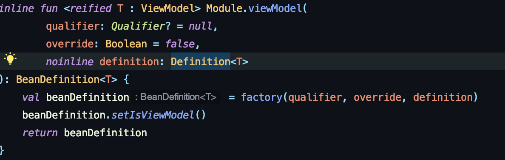
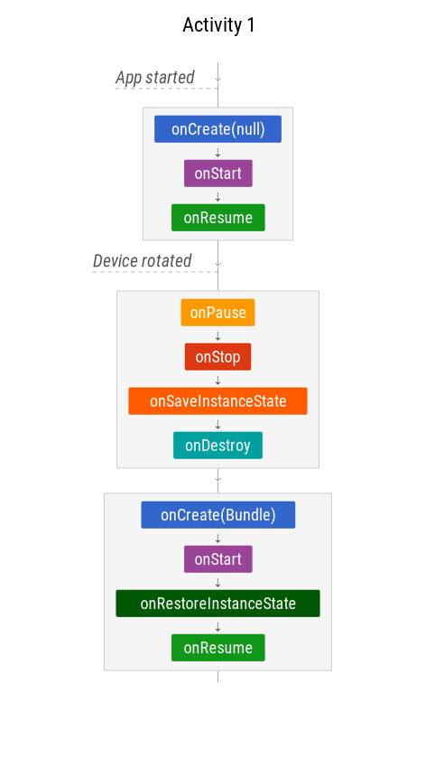

## Koin안에서의 뷰 모델

- koin이라 함은 코인 설명글에서 보았듯이 dagger보다 러닝커브가 조금 낮은 의존성에 대한 라이브러리이다. 그 중 viewModel 이라는 함수에 대해 알아보려고 한다.

## koin없이 ViewModel 초기화

- 우선 코인의 viewmodel에 들어가기 앞서 AAC ViewModel은 어떤식으로 초기화가 이루어지는지 알아 볼 필요가있다.

  ViewModel을 초기화 하기 위해선 두 가지가 필요한데 그 두 가지는 바로 ViewModel을 상속받고있는 ViewModel클래스 하나와 ViewModelProvider클래스이다.

  ex)

  ```kotlin
  lateinit var testViewModel: TestViewModel

  fun onCreate(...) {
      testViewModel = ViewModelProvider.of(this).get(TestViewModel::class.java)
  }
  ```

  하지만 ViewModel을 상속받은 클래스에 생성자에 매개변수가 존재한다면?(커스텀 생성자)

  `ViewModelProvider.Factory`를 반드시 사용해야한다.

  ### 사용방법?

  ```kotlin
  // TestViewModel에 커스텀 생성자에 매개변수가 String형이 있다고 가정.

  //팩토리 클래스를 하나 만들어 줌.
  class TestViewModelFactory(val test: String) : ViewModelProvider.Factory {
        override fun <T : ViewModel?> create(modelClass: Class<T>): T =
                modelClass.getConstructor(String::class.java).newInstance(test)

    }

    //MainActivity

    lateinit var testViewModel: TestViewModel

    fun onCreate(...) {
        private val testViewModelFactory = TestViewModelFactory("HelloWorld")

        testViewModel = ViewModelProvider.of(context, testViewModelFactory).get(TestViewModel::class.java)
    }
  ```

  ViewModelProvider.Factory는 ViewModel을 인스턴스(객체)화 하기위해 자체적 구현이 필요. 즉 ViewModel은 액티비티나 프래그먼트에서 따로 객체를 생성할 수 없기 때문에 뷰 모델의 constructor에서 인자값이 존재 할 시 객체를 만드려면 ViewModelProvider.Factory를 통해서 만들어 줘야한다.
  그럼 ViewModelProvider.Factory에서는 ViewModel의 객체를 만들어 줄 것이다.

## Koin의 viewModel(model의 확장함수.)

- 이제 그럼 본격적으로 koin의 viewModel에 들어가 보도록하자.


    koin의 viewModel을 들어가보면 모듈의 확장함수가 나오게 된다.

    

    함수를 보게되면 factory 모듈 함수가 하나 존재하는데 해당 함수는 inject 할 때마다  새로운 객체를 생성한다.

    주로 사용하게 될 것은 viewModel 함수안의 definition: Definition<T> 매개변수인데 해당 매개변수 클래스를 다시 보게 되면.

    ``` kotlin
    typealias Definition<T> = Scope.(DefinitionParameters) -> T
    ```

    이렇게 되어있다. T를 리턴하는 Scope클래스의 확장함수(매개변수는 DefinitionParameters) 이름을 Definition으로 사용중이다.

    T는 매개변수로 들어갈 ViewModel 클래스를 의미.

    또 해당 함수 안에를 보면

    ``` kotlin
    fun BeanDefinition<*>.setIsViewModel() {
        properties[ATTRIBUTE_VIEW_MODEL] = true
    }
    ```

    이라는 함수가 있는데 해당 함수는 properties의 키값으로 isViewModel를 집어넣고 해당 모듈은 뷰 모델이다 라는걸 캐싱해준다.

    이로인해 모듈로 지정된 ViewModel은 ViewModel 이란 것을 인지하게 된다.

## SavedStateHandler 👥 ViewModel

ViewModel을 쭉 사용하다가 이런글을 보았다. 매우 드문일이지만 가끔 시스템 UI 지연이 일어나게 되면 스스로 어플리케이션을 죽이고 어플리케이션을 담당하는 액티비티 프로세스를 종료한다.

그렇게 되면 액티비티에 보여지던 UI가 파괴되어 이전에 보여지던 화면과 다른화면이 나타날 수도 있다. Ex) 카운터 수, input창의 텍스트 등...

이 때 savedstatehandler를 사용하면 시스템에 의해 앱이 종료되어도 key-value로 관리하기 때문에 마지막에 저장된 데이터를 불러올 수 있다.

우선 savestatehandler과 ViewModel을 사용하지 않았을 때 상황을 보도록 하자.

보통 액티비티 생명주기를 보면 다음과 같이 움직인다.



위 그림을 설명 하지면 사용자가 앱을 회전시켜서 화면을 가로로 눕히거나 새로로 돌린경우 액티비티가 onPause -> onStop -> onDestory 까지 간 뒤 onSavedInstanceState 호출 후 onDestory를 호출 그러고 가로나 새로의 화면에 맞게 다시 onCreate를 돌리게 된다.

이로 인해 코드상 onSavedInstanceState에서 bundle의 처리를 하지 않으면 데이터를 따로 저장 시킬 수 없다. 기존에 세팅 해놓았던 데이터를 모두 날라가게 된다.

카운터, 입력 했던 결과값 등...

기존에 있던 액티비티가 날라가고 새로운 액티비티가 다시 생성된다. 여기서 onSavedInstanceState함수 안에서 bundle로 값을 저장 해 놓는다면 onCreate의 매개변수로 저장되어있던 값을 회면 화전이후에도 이전의 값을 다시 불러올 수 있게 된다.

ex)
onSavedInstanceState함수 사용하지 않았을 때 결과

```
2020-03-08 20:35:49.417 14741-14741/tsthec.tsstudy.movieapplicationmvvmstudy D/MOVIE-APP: count is  -> 1
2020-03-08 20:35:50.396 14741-14741/tsthec.tsstudy.movieapplicationmvvmstudy D/MOVIE-APP: count is  -> 2
2020-03-08 20:35:51.462 14741-14741/tsthec.tsstudy.movieapplicationmvvmstudy D/MOVIE-APP: count is  -> 3

화면 회전 후

2020-03-08 20:35:49.417 14741-14741/tsthec.tsstudy.movieapplicationmvvmstudy D/MOVIE-APP: count is  -> 1
2020-03-08 20:35:50.396 14741-14741/tsthec.tsstudy.movieapplicationmvvmstudy D/MOVIE-APP: count is  -> 2
2020-03-08 20:35:51.462 14741-14741/tsthec.tsstudy.movieapplicationmvvmstudy D/MOVIE-APP: count is  -> 3
```

onSavedInstanceState함수 사용했을 때 결과

```kotlin
override fun onSaveInstanceState(outState: Bundle) {
        LogUtil.d("here is onSaveInstanceState MovieFragment")
        outState.putInt("count", count)
        super.onSaveInstanceState(outState)
}

onViewCreate (view: View, savedInstanceState: Bundle?) {
    savedInstanceState?.let {
            count = it.getInt("count")
    }
}
```

이런식으로 화면 회전이 일어나면 onSaveInstanceState가 호출 되기 때문에 데이터 저장이 가능해진다.

### ViewModel

ViewModel로 회면 회전 시 호출되는 클래스의 해시값을 확인해보면 동일한 해시값이 출력 되는것을 확인 할 수 있다. 하지만 시스템에 의해 파괴된 테이터는 결과가 다르다.

시스템에 의해 종료되기 전 호출되던 뷰모델 hashcode 값 -> D/MOVIE-APP: what is viewmodel hashcode? -> 238649840

시스템에 의해 종료 후 호출되던 뷰모델 hashcode 값 -> D/MOVIE-APP: what is viewmodel hashcode? -> 55870290

이 말은 두개 다른 클래스이기 때문에 같은 값을 유지시키지 못한다.

### SavedStateHandler + ViewModel 이용

ViewModel을 이용하더라도 똑같이 onSaveInstanceState함수를 이용할 수 있다.

ViewModel Google I/O -> [link](https://www.youtube.com/watch?time_continue=686&v=Qxj2eBmXLHg&feature=emb_title)

그럼 koin 에서는 어떻게 사용??

먼저 모듈에서 viewModel 의 주입 시키기 전 다음과 같이 모듈을 만든다.

```kotlin
viewModel { (handle: SavedStateHandle) ->
    DetailMovieInformationViewModel(
        handle,
        get(),
        get()
    )
}
```

자세히 알고 싶으면 [koin홈페이지](https://doc.insert-koin.io/#/koin-android/viewmodel?id=shared-viewmodel) 를 참고해보면 좋다.

나는 SavedStateHandler를 이런식으로 사용 하였다.

```kotlin
package tsthec.tsstudy.movieapplicationmvvmstudy.ui.movie.detail.movie.viewmodel

import androidx.lifecycle.LiveData
import androidx.lifecycle.MutableLiveData
import androidx.lifecycle.SavedStateHandle
import io.reactivex.android.schedulers.AndroidSchedulers
import io.reactivex.schedulers.Schedulers
import tsthec.tsstudy.movieapplicationmvvmstudy.BuildConfig
import tsthec.tsstudy.movieapplicationmvvmstudy.base.viewmodel.BaseLifeCycleViewModel
import tsthec.tsstudy.movieapplicationmvvmstudy.data.Genre
import tsthec.tsstudy.movieapplicationmvvmstudy.data.MovieResult
import tsthec.tsstudy.movieapplicationmvvmstudy.data.source.MovieRepository
import tsthec.tsstudy.movieapplicationmvvmstudy.rx.RxBusCls
import tsthec.tsstudy.movieapplicationmvvmstudy.util.log.LogUtil
import tsthec.tsstudy.movieapplicationmvvmstudy.util.plusAssign


class DetailMovieInformationViewModel(
    private val handle: SavedStateHandle,
    private val movieRepository: MovieRepository,
    private val rxEventBusDataSubject: RxBusCls
) :
    BaseLifeCycleViewModel<MovieResult>() {

    private val GENRE_KEY = "GENRE"

    var saveGenreState: List<Genre>? = handle[GENRE_KEY]
        set(value) {
            handle[GENRE_KEY] = value
            field = value
        }

    init {
        disposable += uiBehaviorSubject
            .subscribeOn(Schedulers.io())
            .observeOn(Schedulers.io())
            .switchMapSingle { movieResult ->
                movieRepository.loadCacheDatabaseList(movieResult)
            }
            .observeOn(AndroidSchedulers.mainThread())
            .map { likeState ->
                if (likeState)
                    rxEventBusDataSubject.publish(
                        Pair(
                            {
                                movieRepository.repositoryDeleteDatabase(
                                    handle.get<MovieResult>(
                                        DETAIL_MOVIE_KEY
                                    )
                                )
                            },
                            { _favoriteState.value = false }
                        )
                    )
                else
                    rxEventBusDataSubject.publish(
                        Pair({
                            movieRepository.repositoryMovieInsertRoomDatabase(
                                handle.get<MovieResult>(
                                    DETAIL_MOVIE_KEY
                                )
                            )
                        }, {
                            _favoriteState.value = true
                        })
                    )
            }
            .subscribe({
                _isLoadingMutable.value = true
            }, {
                it.printStackTrace()
            })
    }


    fun getResultDetailMovie(movieID: Int?) {
        disposable += movieRepository.repositoryDetailMovie(
            movieID,
            apiKey = BuildConfig.MOVIE_API_KEY
        ).observeOn(AndroidSchedulers.mainThread())
            .subscribeOn(Schedulers.io())
            .subscribe({
                genreLiveData.value = it.genres
                saveGenreState = genreLiveData.value
            }, {
                it.printStackTrace()
            })
    }

    fun loadSaveState() {
        genreLiveData.value = saveGenreState
    }
}
```

클래스 내부 함수에서 보이듯이 첫 호출만 네트워크를 통해 호출 후 SavedstateHandler에 저장 그 다음 뷰모델 호출(시스템에 의해서 종료 or 유저가 화면을 전환)부터는 SavedstateHandler에 의해 호출 되도록 만들었다.

## 마무리

- DI 없이 뷰 모델을 생성하기 위해선 커스텀 생성자가 아닌 뷰 모델은 Factory 생성없이 바로 사용 가능하지만 커스텀 생성자일 경우 ViewModelProvider.Factory를 상속받은 클래스를 만들어야한다.

- 기존 ViewModel은 `따로 인스턴스를 생성하지 못함!!!!`

- koin 으로 viewModel을 생성 할 경우 factory 형으로 생성이 되기 때문에 inject를 여러번 할 경우 새로운 인스턴스를 만든다.

- ViewModel은 화면전환 할 때에 데이터가 유지 되지만 시스템에 의해 종료된 경우에는 데이터 유지가 되지 않는다. -> 이를 대비해서 SavedStateHandler가 koin에서 나옴.
