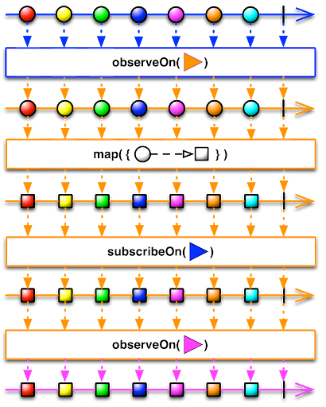

## subscribeOn과 observeOn차이

- 스케줄러를 담당하는 함수는 크게 두가지 subscribeOn 과 observeOn이렇게 두가지가 있다. 두 가지 다 매개변수로 스케쥴을 받는것은 동일하지만 어느 함수를 어디서 실행할지를 정하는것이 두개의 차이점이다. 우선 스케줄러에 대해 알아보겠습니다.

## Schedulers

- 스케쥴러의 메서드는 총 6가지가 있다. 그중 내가 여태껏 많이 사용해왔던 메소드는 io()(input,output 메소드 이다.) 책을 참고하면서 연산에 주로 사용되는 computation을 가끔 사용해본적은 있지만 정확히 어떤 메소드인지를 몰랐다. 각각 메소드들이 하는 역할들을 자세히 알아보자.

1. computation

   - 해당 함수는 연산 처리를 할 때 사용하는 스케줄러이다. 논리 프로세스 수와 같은 수만큼 스레드를 캐시한다. I/O 처리 작업에는 사용 x

2. io

   - 나에게 가장 익숙한 함수. 네트워크 비동기 작업에 주로 이용 되는 함수이다. 혹은 입출력에 대한 작업이 이루어질때 사용하는 함수이다.

3. single

   - 싱글 스레드에서 처리할 때 작업하는 스케줄러이다. 단 비동기 작업을 지향하기 때문에 사용할 일은 거의 드물다.

4. newThread
   - 함수 이름과 같이 말그대로 매번 새로운 스레드를 생성하는 함수이다.

## subscribeOn함수

- subscribeOn함수라고 하면은 구독(subscribe)해서 사용할 스레드를 지정. 후에 여러번의 observeOn 메서드가 여러번 호출이 되어도 subscribeOn 메서드에는 영향을 끼치지 않는다. 또 observeOn과 다르게 아무리 많은 subscribeOn이 다른 스케줄러에서 호출이 되어도 첫 실행 1회때만 영향을 미치고 최초 subscribeOn에서 설정된 스케줄러에서 변하지 않는다.

## observeOn 함수

- observeOn 함수는 subscribeOn 함수와 다르게 호출 될 때마다 어느 스레드에서 동작하게 할 것인지 정할 수 있다. 예를들어 첫 번째 처리 작업은 AndroidSchedulers.mainThread()에서 동작시키고 싶고 두 번째 처리작업은 Schedulers.computation() 이나 Schedulers.io()에서 작업 시킬 수도 있다.

## 마무리

- subscribeOn 함수는 아무리 호출이 여러번 되어도 최초 1회 실행된 스케줄러에서 동작한다.

- observeOn 함수는 다음 처리를 어느 스케줄러에서 동작시킬것 인지 정할 수 있다. 즉 여러번 다른 스레드에서 호출 가능하다.
